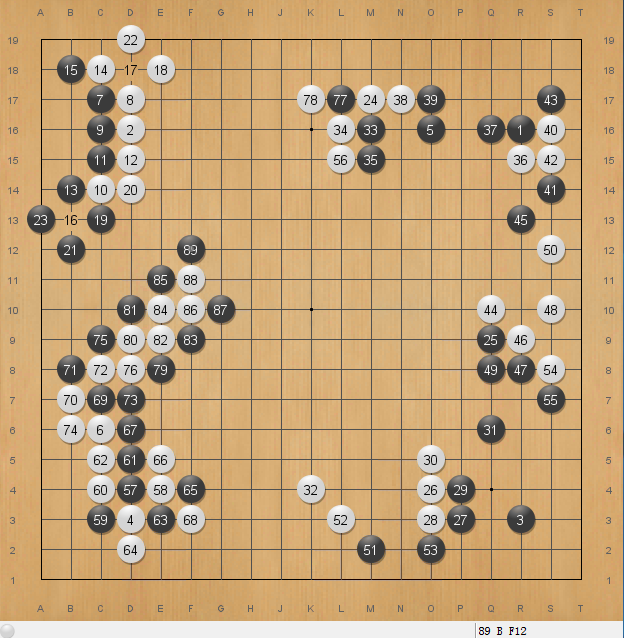

# FancyBing (饭西饼)
用纯JAVA实现的围棋AI，深度学习框架使用的是Deeplearning4J。用JAVA的原因是，我的C/C++已经几乎忘光了。
技术实现基于谷歌的AlphaGo系列论文，特别是"[Mastering the Game of Go without Human Knowledge](https://deepmind.com/documents/119/agz_unformatted_nature.pdf)"。
由于计算资源限制，我只有一个1080卡，所以FancyBing使用了小的多网络，并且没有自我对局进行增强学习的过程。
训练主要是基于Tygem9d和职业的150多万人类棋谱，后期混合了Leelazero的最新30多万(从600万到630多万)Self Play对局。

# 棋力
较弱的野狐9d(18cores + 1 GTX1080, 15s), 较弱的原因也有部分是9d上面的AI太多，有差不多一半是输给AI对手，对局中我可以明显感觉到对手是用LeelaZero。也有少量是我搬运的过程中点错鼠标。
FancyBing要比LeelaZero新版弱一档次，差不多相当于Zen 9d的水平，不过不如zen稳定。

# 我做的一些改进
## 用过采样解决征子问题
因为逃征子在实际对局中是几乎不可能出现的，高手通常预先就会避免不利的征子局面出现，即使被引征成功，也不会继续逃征子。另外实际对局中也存在十分复杂的征子情况，所以基于人类棋谱训练的网络是无法学会征子这么复杂的逻辑。
即使是自我对局，征子在对局中出现的比例也不是很高，也要经过相当长的积累后才能逐渐学会。

为了更快的让网络掌握征子，FancyBing在训练末期人为增加了征子样本的比例。首先是从LeelaZero的最新300多万对局中抽取了50万的连续打吃5次以上的局面(虽然不准确但简便的判断征子局面的方法)，然后以大约1-2%比例混合在正常训练数据中进行针对性训练。
经过大约2万steps(batch:128)的训练，网络的征子水平得到大幅提高。大部分征子问题，都可以在5000-20000次playout后识别出来。

下面是一个来自顶级AI BensonDrr的实战对局，本森狗狗在野狐上几乎战无不胜，鲜有失手，但也栽在了这个征子陷阱上。这说明征子对AI来说确实是一个难题。那经过上面特殊训练的FancyBing在这里表现如何呢？下面是测试结果：
1) 当黑棋75手打吃的时候，FancyBing下白棋的话，它也会76位逃出，这不算问题，因为这时征子是有利的。
2) 黑棋的77手是一个很巧妙的引征手段，不细算的话，对像我这样的业余爱好者来说，一不小心也就78手打吃了。这个局面FancyBing来下的话，它的第一感也是78手，但很快它会发现这是个陷阱，并最终会选择下在E7吃住下面的黑棋
3) 即使白棋78手中计打吃了，黑79手开征的时候，FancyBing不会80手继续外逃，它会选择在E2吃掉黑一子避免扩大损失。

## 提高打劫能力
方法同上，不同的是打劫的moves是从高段对局中抽取的.

## 提高开局水平
经过正常训练后，再专门抽取前100手的数据进行专门训练，使网络对准确度和MSE进一步提升。在对局时，前80手使用开局网络进行评估，后面的用普通的网络评估。
经过专门训练后，Fancybing从弱8d升到了9d。还是有比较明显的进步的。
我也试过专门用100+的数据训练中盘网络，以前使用180+的数据训练收官网络，但似乎没有明显提升。我没有做完整的测试。

# 运行要求
* 推荐 8G+ 内存
* Nvidia GPU和驱动
* [CUDA 8.0](https://developer.nvidia.com/cuda-zone)
* [CUDNN 6.0](https://developer.nvidia.com/cudnn)
* [JDK1.8+](http://www.oracle.com/technetwork/java/javase/downloads/index.html)
* [GoGUI](https://sourceforge.net/projects/gogui/)

# 使用说明
首先，我不推荐普通爱好者使用任何棋软做外挂在各大围棋对弈平台上狐假虎威。对爱好者来说和过多的AI下棋并没有多大乐趣。
如果出于测试目的，请在ID或者说明里注明AI，给予你的对手尽可能的知情权，以方便对手接受或者拒绝与AI对局。

所以，我没有在这里过多简化运行要求和使用步骤，这些环境和步骤对于真正的AI开发者来说应该是比较容易的。

## Windows
* 完成上面运行要求的内容
* 到Release页面下载FancyBing包并解压
* 运行 startPolicyNetService.bat，并等待启动完毕
* 运行 startFancybingService.bat
* 将FancyBing GTP Player 加载到 GoGui, open GoGUI > Program > New Program Command: java -jar fancybing-gtp-1.0.jar Working Directory: the path of Fancybing 

# 训练
## Download SGFs
[Computer go database](https://github.com/yenw/computer-go-dataset)
Please transfer other format into sepearte SGF files.

## Generate the training data
See [FeatureGenerator.java](/fancybing-train/src/main/java/net/xdevelop/go/preprocess/FeatureGenerator.java)

The generator would random pick moves from the sgfs and generate feature files named 0.txt, 1.txt, 2.txt... each contains 51200 records.

Please use the all() function to generate normal training data. The open(), mid(), end() functions are used to generate data for opening, mid, end game.

Unlike AlphaGo Zero's 18 features, Fancybing uses 10 features only:
1) Black Stones
2) White Stones
3) Empty Points
4) 1 liberties stone group
5) 2 liberties stone group
6) 3 liberties stone group
7) &gt;3 liberties stone group
8) Ko
9) last 8 history moves
10) next move color

## Training
See [ResNetwork.java](/fancybing-policynet/src/main/java/net/xdevelop/go/policynet/PolicyNetService.java)

The early stop implementation is not good enough in DL4j 0.9.1, so I train the model by sepearate data file, so that you can stop the training at any time, and adjust the learing rate then continue the training by manual increase the start file index.

# License
The code is released under the GPLv3 or later, any commercial usage please contact me (john.h.cn@gmail.com).
